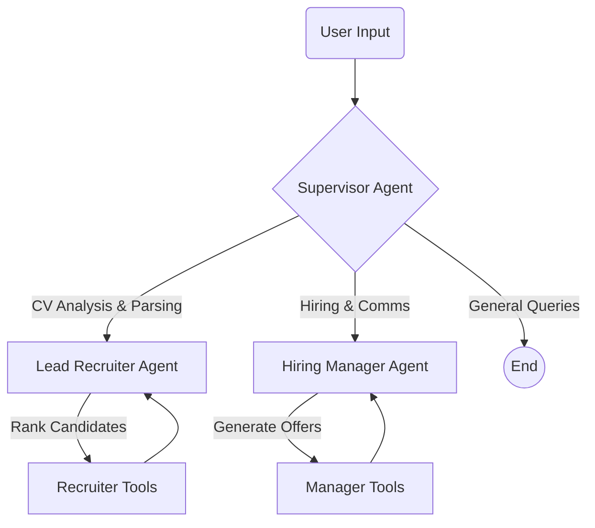

# Intelligent HR Recruitment Platform

## Overview

Welcome to the **Intelligent HR Recruitment Platform**, a cutting-edge application powered by multi-agent AI (using LangGraph) to streamline and automate the entire recruitment lifecycle.

This platform simulates a real-world HR team with two specialized AI agents working together under a Supervisor:

1.  **Lead Recruiter Agent**: Focuses on candidate analysis, parsing CVs, extracting skills, and ranking applicants against job descriptions.
2.  **Hiring Manager Agent**: Handles the "hiring" side, including generating job offers, checking market salaries, retrieving company templates, and drafting communication.

## Key Features

### 🔍 Candidate Analysis (Recruiter Agent)
-   **CV Parsing**: diverse support for PDF and DOCX formats.
-   **Skill Extraction**: Automatically identifies technical skills, years of experience, and education.
-   **Smart Ranking**: Users semantic search (embeddings) to rank candidates based on job relevance, not just keyword matching.
-   **Bias Reduction**: Integrated PII anonymization (removes names/emails/phones) for fair screening.

### 📝 Hiring & Operations (Manager Agent)
-   **Job Offer Generator**: Creates professional offer letters using company templates.
-   **Market Salary Check**: Provides real-time salary ranges and recommendations for common tech roles.
-   **Template Retrieval**: Intelligently searches the company knowledge base for relevant policy/benefit documents.
-   **Email Drafting**: Composes interview invitations and rejection emails automatically.

## How to Run

1.  **Install Dependencies**:
    ```bash
    pip install -r requirements.txt
    ```

2.  **Prepare Knowledge Base (Optional)**:
    Populate the system with company data (templates, values).
    ```bash
    python scripts/ingest_knowledge.py
    ```

3.  **Launch the Application**:
    ```bash
    .\run_app.bat
    ```
    *Or manually:*
    ```bash
    python -m streamlit run app.py
    ```
    *(Note: Use `python -m streamlit` to avoid path issues on Windows)*

## System Architecture

The platform is built on **LangGraph**, utilizing a hierarchical multi-agent system.

### Agent Workflow


1.  **Supervisor Agent**: The entry point. It analyzes the user's request (e.g., "Rank these 5 CVs" vs "Draft an offer email") and routes it to the appropriate sub-agent.
2.  **Lead Recruiter Agent**: A specialized worker node responsible for all candidate-facing data processing.
3.  **Hiring Manager Agent**: A specialized worker node responsible for output generation, communication, and salary data.

## Tools & Capabilities

### 🛠️ Lead Recruiter Tools
| Tool | Description |
|------|-------------|
| `cv_parser_tool` | Extracts text and metadata from PDF/DOCX files. Handles layout analysis. |
| `text_cleaner_pipeline` | Normalizes text, removes emojis/special characters, and fixes encoding issues. |
| `skill_extractor_tool` | Uses NLP to identify technical skills, soft skills, and years of experience. |
| `candidate_summarizer` | Generates a concise professional profile summary for quick review. |
| `cv_ranker` | Computes semantic similarity scores between candidate profiles and job descriptions (using `sentence-transformers`). |
| `job_scraper_tool` | Fetches job descriptions from URLs to use as a ranking baseline. |
| `batch_cv_parser` | Handles bulk uploads, processing multiple candidates simultaneously. |

### 💼 Hiring Manager Tools
| Tool | Description |
|------|-------------|
| `job_offer_generator` | Auto-generates formal job offer letters, filling in candidate details into standard templates. |
| `market_salary_check` | Consults a database of real-time market rates to validate compensation packages. |
| `template_retriever_tool` | Uses RAG (Retrieval-Augmented Generation) to find relevant company policies or email templates from the vector store. |
| `offer_validator_tool` | Ensuring generated offers contain no missing placeholders before sending. |

## Contact

Developed by the **Integration Project Team**.
For support or inquiries, please contact the development team.
